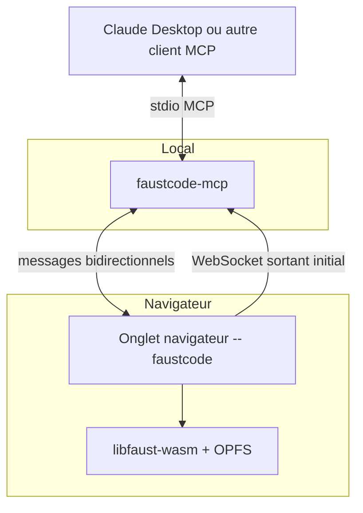
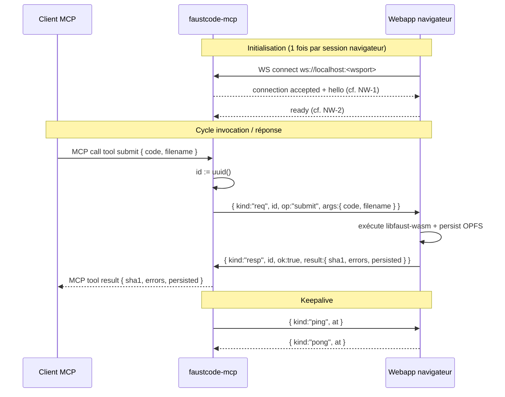

# Spécification : faustcode

## Scénario de référence

Un utilisateur visite l'URL publique de faustcode (servie par GitHub Pages). La
webapp se charge dans son navigateur ; toutes les fonctionnalités exploitables
manuellement (édition DSP, compilation, run audio, navigation des sessions)
fonctionnent immédiatement, sans aucun prérequis local.

Pour piloter faustcode depuis un assistant IA (Claude Desktop par exemple),
l'utilisateur ouvre le panneau « Activer MCP » de la webapp. Celle-ci détecte
son OS et lui propose le téléchargement direct du binaire `faustcode-mcp`
correspondant à la version courante de l'application. Une fois téléchargé et
lancé en local, `faustcode-mcp` joue à la fois le rôle de serveur MCP
(stdio) face au client IA et de serveur WebSocket face à l'onglet du
navigateur. Il charge `tools.json` (le contrat partagé décrivant les
opérations exposées) au démarrage et déclare un tool MCP par entrée.

À partir de ce moment, l'assistant IA dispose des mêmes opérations que la
version Docker actuelle, mais toute la logique métier reste exécutée dans
l'onglet du navigateur.

## Objectif

Permettre l'usage de faustcode sans Docker et sans Node côté utilisateur
final, en préservant les fonctionnalités MCP de la version actuelle.

## Hors-périmètre

- **Édition live d'un fichier `.dsp` hôte via VSCode** : abandonnée en version
  standalone (nécessitait le mapping host/container Docker). La fonctionnalité
  peut être reprise plus tard dans un plugin VSCode séparé qui parlerait
  directement à libfaust-wasm.
- **Génération de code C++ et vue `cpp` associée** : abandonnée en version
  standalone. Le backend C++ du compilateur Faust n'est pas embarqué dans
  l'image WASM officielle (`@grame/faustwasm`) ; le POC le confirme — voir
  [poc/libfaust-wasm-aux-files/](poc/libfaust-wasm-aux-files/). Les
  opérations MCP associées (`set_view "cpp"`, `get_view_content` sur
  `view="cpp"`, presets d'options C++ — anciennes O-8bis et MCP-4 partielles
  côté cpp) sortent du contrat `tools.json` de la version standalone. Les
  utilisateurs qui ont besoin du C++ restent sur la version Docker actuelle.
- **Pré-génération côté serveur d'artefacts PWA téléchargeables** : remplacée
  par génération à la demande côté navigateur (libfaust-wasm + Web Bundling
  côté client).
- **Synchronisation multi-instances entre utilisateurs** : la version
  standalone est mono-utilisateur. Le partage explicite (export/import de
  session) reste possible.

---

## Architecture



`faustcode-mcp` est un binaire local intégré qui assume deux rôles dans un
seul process :

- **serveur MCP** (stdio) face au client (Claude Desktop ou équivalent) — il
  charge `tools.json` au démarrage et expose un tool MCP par entrée ;
- **serveur WebSocket** face à la webapp — chaque tool invoqué envoie un
  message WS à l'onglet ouvert, attend la réponse correlée, et renvoie le
  résultat au client MCP.

Inversion de l'initiative à noter : c'est la page qui ouvre la connexion
WebSocket sortante vers `faustcode-mcp` (le navigateur ne peut pas accepter
de connexions entrantes). Une fois la connexion établie, le canal est
bidirectionnel et `faustcode-mcp` peut envoyer des messages à l'onglet à
volonté.

### Découpage des responsabilités

```adt
Webapp          ::= { ui, libfaust-wasm, sessions OPFS, state, ws-client }   (* navigateur, spécifique faustcode *)
FaustforgeMcp   ::= { mcp-server, ws-server, tools-from-contract }           (* local, partiellement générique *)
ClientMCP       ::= "Claude Desktop" | "autre client compatible"             (* externe *)
```

`faustcode-mcp` est *partiellement* générique : la partie « charger un
contrat de type `tools.json` et générer des tools MCP qui s'adressent à un
endpoint WS » l'est totalement ; le packaging et la valeur par défaut du port
le rendent faustcode-spécifique. Le code de glue (~50 lignes selon le
runtime retenu) pourra être extrait dans une lib séparée si l'occasion se
présente.

---

## Composants

### 1. Webapp (navigateur, 100% client)

- **UI** : la même que la version actuelle moins la vue `cpp` (cf.
  §Hors-périmètre), donc les vues `dsp`, `svg`, `run`, `signals`, `tasks`.
- **Compilation Faust** : `libfaust-wasm` via `generateAuxFiles(name, code,
  args)` pour produire `svg/`, `signals.dot`, `tasks.dot`, et via
  `FaustMonoDspGenerator` / `FaustPolyDspGenerator` pour la compilation WASM
  runtime (déjà en place dans la vue Run aujourd'hui). La génération de
  `generated.cpp` est abandonnée — confirmé par le POC, le backend C++ n'est
  pas inclus dans le binaire `libfaust-wasm`.
- **Persistance** : sessions stockées dans OPFS (cf. §Persistance navigateur).
  Ordre `chronological` / `usage` reconstruit au démarrage par scan.
- **État partagé Run** (`runParams`, `runTrigger`, `runMidi`, `runTransport`,
  `spectrumSummary`) : en mémoire navigateur, exposé via les opérations du
  contrat partagé.
- **Client WebSocket** : se connecte à `faustcode-mcp` au chargement (si le
  mode MCP est activé), gère reconnexion et sérialise les messages WS.
- **Panneau « Activer MCP »** : UI qui détecte l'OS du visiteur, propose le
  téléchargement du binaire `faustcode-mcp` adéquat (lien stable vers
  GitHub Releases), affiche les instructions de lancement, et indique l'état
  de connexion une fois le binaire actif (cf. §Distribution).

### 2. `faustcode-mcp` (binaire local intégré)

- **Serveur MCP (stdio)** : reçoit les invocations de tools de la part du
  client MCP (Claude Desktop ou autre).
- **Serveur WebSocket** : écoute sur `localhost:<wsport>` et accepte la
  connexion sortante depuis la webapp.
- **Tools auto-générés** : au démarrage, charge `tools.json`, itère sur la
  liste et déclare dynamiquement un tool MCP par entrée. Chaque entrée du
  contrat fournit `name`, `description`, `inputSchema` (JSON Schema) et
  `outputSchema` (JSON Schema) — exactement la forme attendue nativement par
  le SDK MCP.
- **Dispatch d'un tool** : à l'invocation, encapsule les arguments dans un
  message WS `WsReq` (cf. §Protocole de communication), envoie sur la
  connexion, attend la `WsResp` correlée, renvoie son `body` au client MCP.
- **Logique métier nulle** : `faustcode-mcp` ne connaît ni Faust, ni DSP, ni
  session. Il connaît juste le contenu de `tools.json` et le mapping `name`
  d'outil → message WS.
- **Distribution** : binaire unique, lancé typiquement via `npx
  faustcode-mcp` ou téléchargement direct.
- **Runtime** : **Go** (cf. §Stack technique de faustcode-mcp), avec
  cross-compilation native vers les cinq cibles définies en §Distribution.

### 3. Contrat partagé (`tools.json`)

- **`tools.json`** est la source de vérité unique des opérations exposées
  (auparavant doublonnées entre `src/routes/*.ts` et `mcp.mjs`).
- Embarqué dans le bundle de la webapp (build-time) ET dans le binaire
  `faustcode-mcp` (build-time). La cohérence des deux copies est garantie
  par référence commune à un fichier source unique dans le repo.
- Le format est aligné directement sur la forme attendue par le SDK MCP, pas
  de couche d'abstraction intermédiaire :

```adt
ToolDef ::= {
  name        : String,                       (* identifiant unique, ex: "submit", "set_run_param" *)
  description : String,                       (* phrase d'usage pour le client MCP *)
  inputSchema  : JsonSchema,                  (* schéma des arguments du tool *)
  outputSchema : JsonSchema,                  (* schéma du résultat *)
  stability?   : "stable" | "experimental" | "deprecated",
  deprecated?  : Bool
}

ToolsContract ::= {
  contractVersion : String,                   (* SemVer, ex: "1.0.0" *)
  tools           : List<ToolDef>
}
```

- Couvre les opérations exploitables côté navigateur (cf.
  [SPECIFICATION.md](SPECIFICATION.md) pour la liste de référence côté
  Docker). Catégories conservées : submit, sessions (list / get / prev /
  next / delete), view (set / get_content, sans `cpp` — cf. §Hors-périmètre),
  run (params / transport / trigger / midi / polyphony), spectrum (get /
  set_and_capture / trigger_and_capture), library doc (search / symbol /
  list_module / examples / explain). Les opérations liées à la compilation
  C++ (O-8bis presets, `view="cpp"`) sont retirées du contrat.
- Le choix d'OpenAPI a été délibérément écarté : 80 % de la spec OpenAPI
  (servers, content negotiation, status codes, content types) ne sert à rien
  ici, et les concepts `method` / `path` ne correspondent à aucun transport
  réel — le canal est WebSocket, pas HTTP REST.

---

## Stack technique de `faustcode-mcp`

### Choix : Go

| Composant | Choix | Note |
| --- | --- | --- |
| Langage | **Go** | Compilation native cross-platform, binaire monofichier ~5-15 MB, démarrage instantané |
| SDK MCP | [`github.com/modelcontextprotocol/go-sdk`](https://github.com/modelcontextprotocol/go-sdk) | SDK Go officiel, maintenu en collaboration avec Google. v1.6.1 au moment de la rédaction |
| Lib WebSocket | [`github.com/gorilla/websocket`](https://github.com/gorilla/websocket) | Mature (~22 k stars), API minimaliste, gestion correcte des frames texte/ping/pong |
| Lib JSON Schema | à arbitrer entre `github.com/santhosh-tekuri/jsonschema` (validateur draft-07/2020-12) ou `github.com/kaptinlin/jsonschema` (récent) | utile pour valider les `WsResp.result` côté faustcode-mcp avant renvoi MCP, et pour défense en profondeur sur `WsReq.args` |

### Pourquoi Go plutôt que Bun/Python/Node

Critère décisif : **UX de téléchargement et de lancement côté utilisateur final**
(cf. §Distribution). Le binaire Go pèse 5 à 10 fois moins qu'un équivalent
Bun-compile et démarre plus rapidement. Les ~300-400 MB d'images Bun-compile
multi-OS contre ~40-60 MB pour Go font une différence sensible sur GitHub
Releases et sur la perception « petit outil utilitaire » côté utilisateur.

L'argument historique « SDK MCP officiel uniquement en Python et TypeScript »
n'est plus valide : depuis mai 2026, Anthropic en collaboration avec Google
publie un SDK Go officiel mature.

### Conséquence sur le code de glue

Le code de `faustcode-mcp` se résume à :

- au démarrage : charger `tools.json`, instancier un serveur MCP stdio via le
  SDK officiel, déclarer un tool par entrée du contrat ;
- en parallèle : ouvrir un serveur WebSocket sur `127.0.0.1:<wsport>` via
  gorilla/websocket, accepter au plus une connexion ;
- à l'invocation d'un tool : générer un `id`, sérialiser un `WsReq`, écrire
  sur la WS, attendre la `WsResp` correlée dans un registre `inflight`,
  renvoyer le `result` au SDK MCP ;
- périodique : envoyer un `ping` et superviser le `pong`.

Estimation : 300-500 lignes de Go au total, hors tests.

---

## Distribution de `faustcode-mcp`

`faustcode-mcp` est téléchargé par l'utilisateur depuis la webapp elle-même.
Une seule URL à connaître (celle de la webapp) ; pas de package manager ;
pas de chasse au binary sur des registres externes.

### Forme du binaire

```text
DIS-1 : `faustcode-mcp` est distribué sous forme de binaires natifs
        monofichiers, un par couple (OS, architecture).

DIS-2 : Cibles minimales du MVP :
          - darwin-arm64    (macOS Apple Silicon)
          - darwin-amd64    (macOS Intel)
          - linux-amd64
          - linux-arm64
          - windows-amd64
```

### Hébergement

```text
DIS-3 : Les binaires sont publiés sur GitHub Releases du dépôt
        faustcode (ou d'un dépôt sœur faustcode-mcp).

DIS-4 : URL conventionnelle stable :
          https://github.com/orlarey/faustcode/releases/download/
            v<contract-version>/faustcode-mcp-<os>-<arch>[<ext>]
        où <ext> = ".exe" sur windows, vide ailleurs.

DIS-5 : GitHub Pages ne sert PAS directement les binaires (économie
        de bande passante du quota Pages). La webapp ne stocke que
        des liens vers Releases.
```

### Sélection de version côté webapp

```text
DIS-6 : Au build de la webapp, un fichier `mcp-version.json` est
        figé dans le bundle :
          { mcpVersion: "X.Y.Z", contractVersion: "X.Y.Z" }
        Ces champs sont alignés sur la version du contrat
        partagé embarqué dans la webapp (cf. SRV-2).

DIS-7 : Le panneau « Activer MCP » construit le lien de
        téléchargement à partir de DIS-4 et DIS-6, sans hardcode.

DIS-8 : La cohérence webapp ↔ binaire téléchargé est garantie par
        construction : la webapp ne propose au téléchargement que
        la version mcpVersion qui correspond à son propre build.
        L'utilisateur ne peut pas se retrouver avec une webapp v2
        et un faustcode-mcp v1, sauf à télécharger manuellement
        depuis Releases.
```

### Détection OS et fallback

```text
DIS-9  : La webapp détecte l'OS et l'architecture du visiteur via
         `navigator.userAgentData.platform` quand disponible
         (Chromium-based), sinon via parsing du User-Agent.

DIS-10 : Si la détection échoue ou est ambiguë (ex. iOS, Android),
         le panneau affiche un sélecteur manuel listant les cibles
         de DIS-2.

DIS-11 : Sur mobile (iOS/Android), aucun binaire n'est utile : le
         panneau affiche un message expliquant que le mode MCP
         requiert un OS desktop.
```

### Sécurité au premier lancement

```text
DIS-12 : Les binaires distribués pour le MVP ne sont PAS signés.
         macOS Gatekeeper et Windows SmartScreen demanderont
         confirmation au premier lancement.

DIS-13 : Le panneau « Activer MCP » affiche les instructions
         spécifiques à l'OS pour autoriser l'exécution :
           - macOS : « Clic droit > Ouvrir » au premier lancement
                     ou `xattr -d com.apple.quarantine ./faustcode-mcp`
           - Windows : « Plus d'infos > Exécuter quand même »
           - Linux : `chmod +x ./faustcode-mcp`

DIS-14 : La signature de code (Apple Developer ID, Windows
         Authenticode via Azure Trusted Signing ou équivalent) est
         un objectif post-MVP, à arbitrer en fonction du volume
         d'utilisateurs et de la friction observée.
```

### Workflow utilisateur attendu

1. Visite de l'URL faustcode.
2. Clic sur « Activer MCP » dans l'UI.
3. Téléchargement automatique du binaire pour son OS (lien GitHub Releases).
4. Lancement du binaire en local (cf. DIS-13).
5. Le panneau bascule en « ✓ MCP actif » dès que la connexion WebSocket est
   établie et le handshake (NW-1..NW-2) validé.
6. Configuration du client MCP (Claude Desktop ou autre) pour pointer sur le
   binaire en stdio.

L'étape 6 reste manuelle dans le MVP. Une amélioration future serait
d'exposer un bouton « Copier la config Claude Desktop » qui produit le
fichier `claude_desktop_config.json` adéquat — à arbitrer après mesure de la
friction réelle.

---

## Protocole de communication

`faustcode-mcp` traduit chaque invocation de tool MCP en un message
WebSocket vers la webapp, attend la réponse correlée, et renvoie le résultat
au client MCP. Aucune logique métier ne transite par `faustcode-mcp` ;
seulement la corrélation requête / réponse et la gestion d'état du canal WS.

### Types des messages WS

```adt
ReqId    ::= UUID v4
ToolName ::= String                                        (* doit correspondre à un `name` déclaré dans tools.json *)
Body     ::= Json | null

WsReq    ::= { kind: "req",  id: ReqId, op: ToolName, args: Body }
WsResp   ::= { kind: "resp", id: ReqId, ok: True,  result: Body }
WsError  ::= { kind: "resp", id: ReqId, ok: False, error: { code: String, message: String } }
WsPing   ::= { kind: "ping", at: Timestamp }
WsPong   ::= { kind: "pong", at: Timestamp }
```

Tous les messages WS sont sérialisés en JSON UTF-8 (frames texte). Le champ
`op` (= `name` d'une entrée de `tools.json`) est le seul identifiant de
routage. Pas de notion de `method` ou `path` HTTP — le canal est WS, le
contrat est natif MCP, ces notions n'ont plus aucun sens. `args` valide vis-
à-vis de `inputSchema` ; `result` valide vis-à-vis de `outputSchema`.

### Flot nominal



### Règles d'invariance et de robustesse

```text
PR-1 : Toute invocation de tool MCP reçoit exactement une réponse ou une erreur explicite.
PR-2 : La corrélation requête/réponse est établie par le champ `id` (UUID v4 généré par faustcode-mcp).
PR-3 : faustcode-mcp conserve un registre `inflight: Map<ReqId, PendingCall>` des invocations en attente. Il est vidé sur réponse, timeout ou déconnexion WS.
PR-4 : L'ordre d'arrivée des réponses WebSocket est indifférent : faustcode-mcp matche par `id`, pas par ordre.
PR-5 : faustcode-mcp accepte au plus une connexion WebSocket active. Une nouvelle connexion remplace l'ancienne ; les invocations en vol au moment du remplacement reçoivent une erreur MCP explicite.
```

### Comportement quand la webapp est absente ou indisponible

```text
PR-6 : Pas de connexion WS active à l'arrivée d'une invocation MCP
       => erreur MCP { code: "no_webapp", message: "faustcode tab not connected" }

PR-7 : Connexion WS qui se ferme alors que des invocations sont en vol
       => chaque invocation en vol reçoit une erreur MCP (code "webapp_disconnected")
       => le registre `inflight` est vidé

PR-8 : Timeout d'une invocation (sans réponse de la webapp dans `requestTimeoutMs`, défaut 60_000)
       => erreur MCP { code: "timeout", message: "..." }
       => faustcode-mcp envoie un message d'annulation à la webapp (best effort)
```

### Reconnexion côté webapp

```text
WA-RC-1 : Au chargement de la page, la webapp tente une connexion WS immédiate si le mode MCP est activé.
WA-RC-2 : Sur déconnexion involontaire, backoff exponentiel : 250ms, 500ms, 1s, 2s, 4s, plafond 30s.
WA-RC-3 : La webapp ne tente pas de connexion si l'URL ne contient pas de paramètre/flag activant le mode MCP (voir §"Activation du mode MCP" ci-dessous).
```

### Activation du mode MCP côté webapp

L'utilisateur ne souhaite pas forcément ouvrir un canal WebSocket à chaque
visite (la version GitHub Pages publique doit pouvoir fonctionner seule).
L'activation est explicite, par exemple :

- paramètre d'URL : `?mcp=ws://localhost:7777`
- ou bouton UI « Connecter à un client MCP » qui demande le port et persiste
  le choix en `localStorage`

Quand le mode MCP est inactif, la webapp se comporte comme aujourd'hui (vue
Run, manipulation manuelle, sans canal WS).

### Heartbeat

```text
PR-9  : faustcode-mcp envoie un `ping` toutes les `heartbeatIntervalMs` (défaut 30_000).
PR-10 : Si aucun `pong` n'arrive dans `heartbeatTimeoutMs` (défaut 10_000), faustcode-mcp ferme la connexion WS et applique PR-7 aux requêtes en vol.
```

### Sécurité (MVP)

```text
SC-1 : faustcode-mcp écoute uniquement sur `127.0.0.1` (loopback), jamais sur `0.0.0.0`.
SC-2 : Le port WS est configurable, défaut `7777` (cohérent avec l'exemple ?mcp=ws://localhost:7777).
SC-3 : Pas d'authentification du flux stdio MCP (sécurité héritée du client MCP, ex. Claude Desktop).
SC-4 : Vérification optionnelle d'un token partagé sur le handshake WS (champ `token` dans le message `ready`) si l'utilisateur veut se prémunir contre un autre process local malveillant qui tenterait de se connecter à la place de la webapp. Désactivé par défaut.
```

---

## Persistance navigateur (OPFS)

### Décision : OPFS (Origin Private File System)

OPFS via la File System Access API, et non IndexedDB.

#### Pourquoi OPFS

- Reproduit fidèlement la structure de répertoires actuelle
  (`sessions/<sha1>/sourcecode/...`), donc le portage de `SessionManager` est
  mécanique : on remplace `fs.writeFileSync` par
  `FileSystemSyncAccessHandle.write`, l'arborescence reste identique.
- Performance correcte sur les artefacts binaires (WASM, SVG, DOT, CPP) sans
  encodage base64.
- Suit le quota d'origine habituel ; pas de limite spécifique à la base.

#### Pourquoi pas IndexedDB

- Imposerait de modéliser une session comme un ensemble d'enregistrements
  clé/valeur (un par artefact, ou un par session avec body sérialisé). Le
  portage de `SessionManager` et des helpers d'archive deviendrait
  significativement plus complexe.
- Les artefacts (SVG, DOT, CPP, WASM) doivent quand même être manipulés comme
  Blobs ou strings ; le bénéfice de simplicité d'IndexedDB s'évanouit.

#### Compatibilité

| Navigateur | Support OPFS |
|---|---|
| Chrome / Edge / Brave | ≥ 86 (2020) |
| Firefox | ≥ 111 (2023) |
| Safari macOS | ≥ 15.2 (déc. 2021) |
| Safari iOS | ≥ 15.2 |

Si OPFS n'est pas disponible, la webapp refuse le démarrage avec un message
explicite. Pas de fallback IndexedDB pour éviter de maintenir deux backends.

### Layout OPFS

```text
opfs:/
  sessions/
    <sha1>/                           — session statique
      sourcecode/<filename>.dsp
      user_code.dsp
      metadata.json
      errors.log
      signals.dot
      tasks.dot
      svg/
        process.svg
        ...
      wasm/                           — optionnel (compile WASM côté Run)
      webapp/                         — optionnel (PWA bundlée à la demande)
    live-<hash>/                      — session live (cf. SPECIFICATION.md)
      ...
  spectrum-cache/                     — snapshots Run récents (LRU borné)
  preferences.json                    — préférences UI persistées
```

Notes :

- `generated.cpp` du modèle Docker disparaît (cf. §Hors-périmètre — C++).
- Le champ `cpp_flags?` de `metadata.json` reste accepté mais ignoré, pour
  préserver la rétro-compatibilité d'éventuelles sessions importées depuis
  la version Docker.

### Métadonnées

Le format `metadata.json` reste identique à la version Docker actuelle (champs
`sha1`, `kind`, `filename`, `compilation_time`, `last_used_time`,
`usage_score`, `source_path?`, `source_mtime_ms?`, `content_sha1?`,
`cpp_flags?`). Le portage est donc orthogonal, sans changement de schéma.

### Multi-onglet

```text
ST-1 : Un seul onglet à la fois écrit dans OPFS.
       => les écritures passent par un Worker dédié qui sérialise les FileSystemSyncAccessHandle.

ST-2 : Si un autre onglet détient déjà la session ouverte en écriture, le
       nouvel onglet passe en lecture seule et affiche une bannière.

ST-3 : La coordination inter-onglets utilise BroadcastChannel pour signaler
       les mutations (création/suppression de session, changement de session
       active).
```

### Export / Import

- **Export** : action UI qui zippe `sessions/<sha1>/` et déclenche un
  téléchargement `<filename>-<sha1>.faustcode.zip`.
- **Import** : drop d'un `.faustcode.zip` qui rejoue les fichiers dans OPFS
  sous le même `sha1`. Idempotent si le contenu est identique.

Le format précis de l'archive sera spécifié dans une annexe séparée si
nécessaire ; pour le MVP, ZIP non chiffré, racine = dossier session.

---

## Versioning du contrat partagé

Deux acteurs (webapp, `faustcode-mcp`) consomment le même `tools.json` et
doivent rester compatibles entre eux. Le contrat de versioning est explicite
et minimal.

### Schéma de version

```adt
ContractVersion ::= { major: Number, minor: Number, patch: Number }   (* SemVer *)
Stability       ::= "stable" | "experimental" | "deprecated"
```

- Le champ `contractVersion` au sommet de `tools.json` est au format SemVer
  (ex. `1.0.0`).
- Chaque `ToolDef` peut porter un champ `stability` (défaut : `"stable"`)
  et/ou `deprecated: true`.

### Politique d'évolution

```text
VS-1 : Ajout d'un tool stable                                  => bump MINOR.
VS-2 : Ajout d'un champ optionnel à inputSchema ou outputSchema => bump MINOR.
VS-3 : Correction non-comportementale (description, exemples)   => bump PATCH.
VS-4 : Renommage / suppression / changement de signature d'un
       tool stable                                              => interdit en MINOR, exige bump MAJOR.
VS-5 : Un tool `stability: "experimental"` peut évoluer
       librement sans bump MAJOR. Sa stabilisation (passage à
       "stable") est elle-même un bump MINOR.
VS-6 : Un tool `stability: "deprecated"` reste fonctionnel
       pendant au moins deux versions MINOR consécutives avant
       retrait effectif (lequel est un bump MAJOR).
```

### Qui embarque le fichier `tools.json`

```text
SRV-1 : faustcode-mcp embarque sa propre copie de tools.json dans son binary.
        Elle est chargée au démarrage pour déclarer les tools MCP.
SRV-2 : La webapp embarque la même copie dans son bundle (build-time).
        Elle l'utilise pour valider les messages WS reçus (args contre
        inputSchema) et router vers les handlers correspondants.
SRV-3 : Les deux copies DOIVENT être identiques au moment du build de
        faustcode-mcp et du build de la webapp. La cohérence est garantie
        par référence commune au fichier source unique tools.json à la
        racine du repo.

SRV-4 : Le build de la webapp produit en outre un fichier statique
        `mcp-version.json` (cf. DIS-6) qui aligne la version MCP
        téléchargeable sur la contractVersion embarquée dans le bundle.
```

### Négociation à l'établissement WebSocket

```text
NW-1 : À la connexion WS, faustcode-mcp envoie immédiatement un message hello :
       { kind: "hello", mcpVersion: "X.Y.Z", contractVersion: "1.0.0" }

NW-2 : La webapp répond avec sa propre version :
       { kind: "ready", webappVersion: "A.B.C", contractVersion: "1.0.0" }

NW-3 : Si major(webapp.contractVersion) ≠ major(mcp.contractVersion),
       la connexion est rejetée avec un message d'erreur explicite. Aucune
       invocation n'est honorée tant que les deux ne sont pas alignés sur la
       même major.

NW-4 : Si minor(webapp) > minor(mcp) : la webapp expose des tools que
       faustcode-mcp ne connaît pas. Avertissement non bloquant.

NW-5 : Si minor(webapp) < minor(mcp) : faustcode-mcp peut invoquer des
       tools que la webapp ne sait pas servir. Avertissement non bloquant ;
       les tools inconnus retournent une erreur MCP
       { code: "op_unknown" }.
```

### Cycle de release

```text
FM-1 : faustcode-mcp charge tools.json au démarrage, pas dynamiquement.
       Toute mise à jour du contrat exige un redémarrage du process.

FM-2 : La cohérence runtime webapp ↔ faustcode-mcp est vérifiée par le
       handshake WS (NW-1..NW-5). Cela suffit puisque les deux acteurs
       embarquent tools.json et déclarent sa contractVersion à la connexion.
```

---

## Mapping vers les opérations existantes

Les opérations du contrat partagé reprennent terme à terme les opérations
[O-1..O-9](SPECIFICATION.md) et MCP-1..MCP-17 de la spec actuelle. Le passage
au tout-client supprime simplement leur backend Docker/Node et substitue :

| Brique actuelle | Substitut standalone |
|---|---|
| `analyzeFaust` (Docker) — `generated.cpp` | non couvert (cf. §Hors-périmètre) |
| `analyzeFaust` (Docker) — `svg/`, `signals.dot`, `tasks.dot` | `libfaust-wasm.generateAuxFiles(name, code, '-lang wasm -o binary -svg \| -sg \| -vec -tg')` côté navigateur, validé par le POC |
| `faust2wasm-ts -pwa` (Docker) | bundling PWA côté navigateur (à creuser : usage de `copyWebStandaloneAssets` de `@grame/faustwasm`) |
| `sessions/<sha1>/` filesystem | OPFS (cf. §Persistance navigateur) |
| `StateStore` en RAM Node | store JS réactif en mémoire onglet |
| `mcp.mjs` stdio + HTTP interne | `faustcode-mcp` (stdio + WS, tools auto-générés depuis `tools.json`) |

---

## Invariants

```text
INV-STD-1 : Aucune logique métier faustcode (compilation, sessions, état Run) ne s'exécute hors du navigateur. faustcode-mcp ne fait que du routage/dispatch.
INV-STD-2 : faustcode-mcp est strictement un relais entre stdio MCP et WebSocket ; il ne peut pas répondre seul à une invocation de tool.
INV-STD-3 : Une session est immuable pour les sessions statiques (cf. INV-1..3 de SPECIFICATION.md) ; cette propriété est préservée par le stockage OPFS.
INV-STD-4 : tools.json est la source unique de vérité des opérations exposées ; tout ajout d'opération côté webapp impose une mise à jour synchrone de tools.json et un re-build de faustcode-mcp.
INV-STD-5 : Si l'onglet faustcode n'est pas ouvert (donc pas connecté à faustcode-mcp), toute invocation de tool MCP retourne une erreur explicite ({ code: "no_webapp" }), pas un timeout silencieux.
```

---

## Risques et points ouverts

À discuter avant de figer la spec :

- **Sérialisation des requêtes longues** (compilation Faust de gros DSP) :
  comment le client MCP perçoit-il un appel qui prend 2-3 secondes ?
  Timeout par défaut à régler (PR-8 fixe 60 s, devrait suffire). À mesurer
  avec un DSP réaliste — le POC sur un oscillateur simple génère les 3
  artefacts en ~50 ms cumulés, donc large marge.
- **Taille du bundle libfaust-wasm** : mesuré via le POC. Composition du
  bundle servi :
  - `libfaust-wasm.js` (loader Emscripten) : 173 KB
  - `libfaust-wasm.wasm` (compilateur Faust) : 3.0 MB
  - `libfaust-wasm.data` (stdlib Faust + assets) : 2.1 MB
  - `faustwasm/index.js` (wrapper ESM) : 186 KB

  Total : ≈ 5.5 MB. Acceptable mais à signaler à l'utilisateur (loading
  state explicite au premier chargement de la vue Run ou du panneau
  « Activer MCP »).
